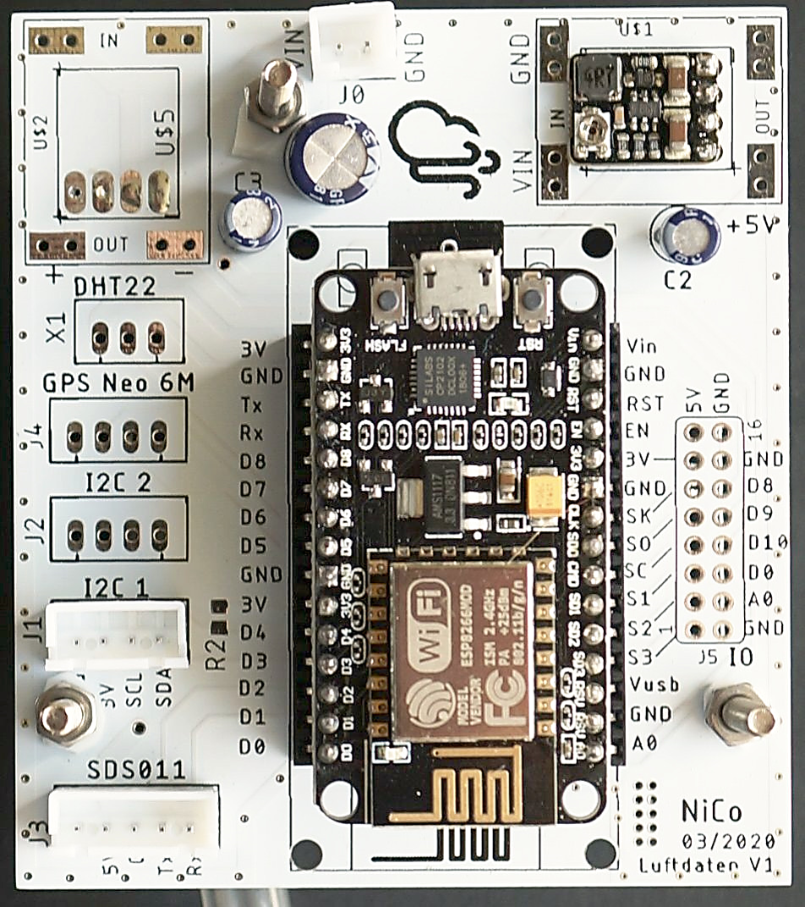
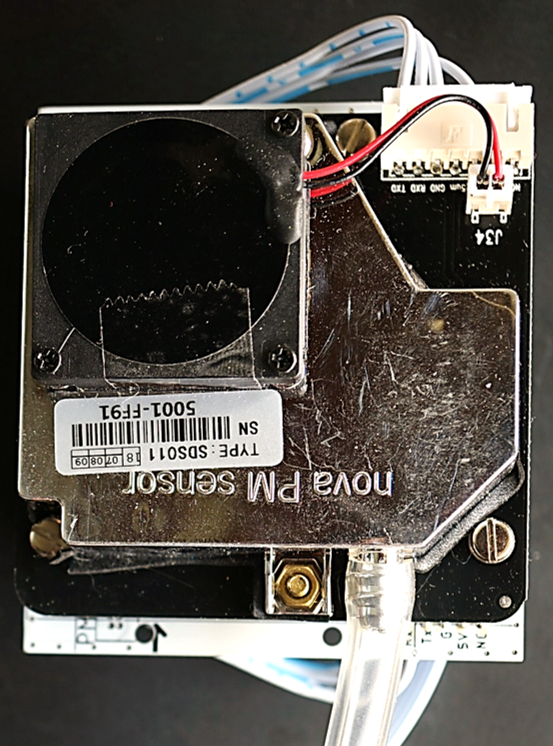
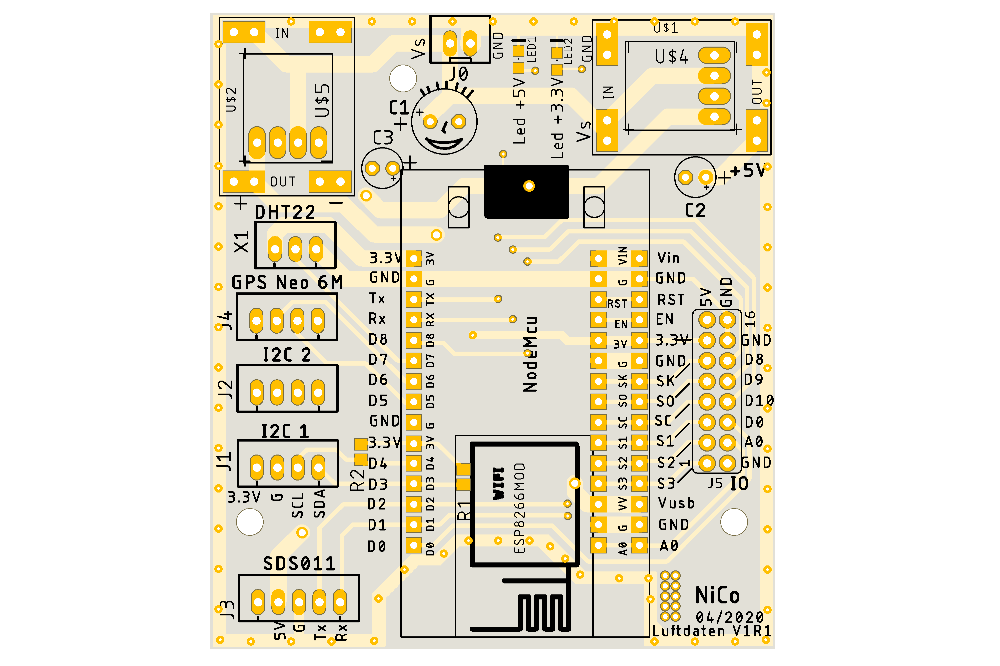
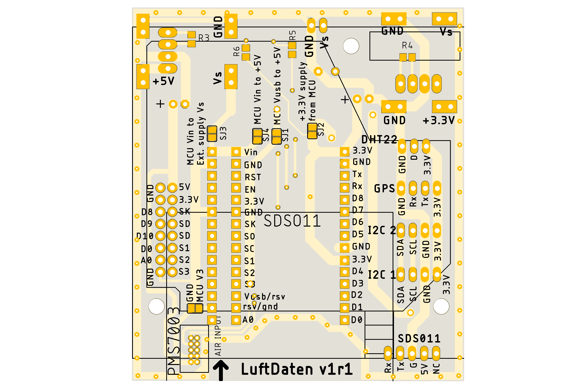

# Luftdaten motherboard
## Description
La carte support luftdaten v1r1 est un circuit imprimé destiné à simplifier et apporter plus d’options au montage du détecteur de particules fines du projet Luftdaten (https://luftdaten.info/fr/accueil/).
Cette carte permet :
* D’exposer les IOs de l’ESP8266 sur des connecteurs.
* De fixer l’ESP8266 et les détecteurs de particules fines SDS011 et PMS7003 sur une même carte, et évite les câblages volants.
* D’utiliser le câble fourni avec le SDS011.
* Différentes options d’alimentation :
  * Câble USB.
  * Alimentation externe directe.
  * Alimentation externe avec régulateurs DC/DC.
  

## Documentation
* Documentation de la carte: [documentation](./doc/Carte%20Support%20Luftdaten%20v1r1.pdf)
* Schéma de la carte: [schéma](./doc/schematic_uftdaten_v1r1.pdf)
* CAO Eagle: [CAO](./cao/)
* Fichiers de fabrication: [gerbers](./manufacturing/)
* Photos du PCB

 
