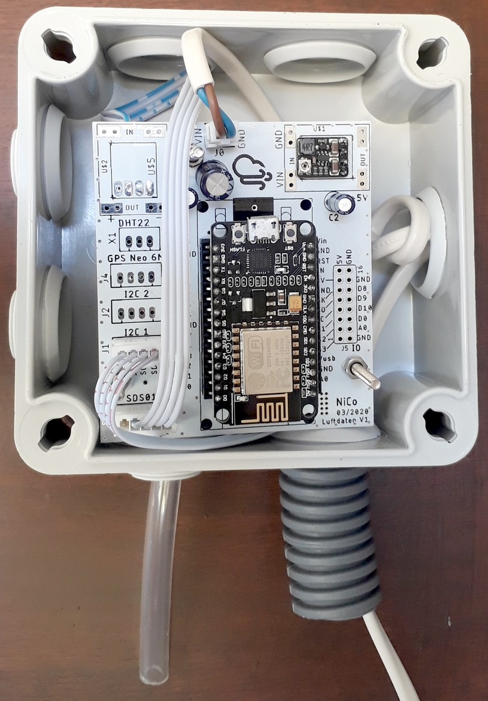

# Luftdaten motherboard
## Description
### French version
La carte support luftdaten v1r1 est un circuit imprimé destiné à simplifier et apporter plus d’options au montage du détecteur de particules fines du projet Luftdaten (https://luftdaten.info/fr/accueil/).
Cette carte permet :
* D’exposer les IOs de l’ESP8266 sur des connecteurs.
* De fixer l’ESP8266 et les détecteurs de particules fines SDS011 et PMS7003 sur une même carte, et évite les câblages volants.
* D’utiliser le câble fourni avec le SDS011.
* Différentes options d’alimentation :
  * Câble USB.
  * Alimentation externe directe.
  * Alimentation externe avec régulateurs DC/DC.

### English version

The luftdaten v1r1 motherboard is a printed circuit intended to simplify and provide more options for mounting the particule matter sensors of the Luftdaten project (https://luftdaten.info/fr/accueil/).
This card allows:
* Access to ESP8266 I/0
* To fix the ESP8266 and the particule matter sensors SDS011 and PMS7003 on the same card, and avoid flying cables.
* Use the cable provided with the SDS011.
* Several power supply options:
	* USB cable.
	* External direct power supply.
	* External power supply with DC/DC regulators.

## Documentation
* Documentation de la carte: [documentation](./doc/Carte%20Support%20Luftdaten%20v1r1.pdf)
* Schéma de la carte: [schéma](./doc/schematic_uftdaten_v1r1.pdf)
* CAO Eagle: [CAO](./cao/)
* Fichiers de fabrication: [gerbers](./manufacturing/)
* Photos du PCB

 
