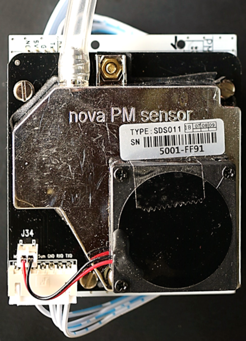

# Luftdaten motherboard
La carte support luftdaten v1r1 est un circuit imprimé destinée à simplifier et apporter plus d’options au montage du détecteur de particules fines du projet Luftdaten (https://luftdaten.info/fr/accueil/).
Cette carte permet :
* D’exposer les IO de l’ESP8266 sur des connecteurs
* De fixer l’ESP8266 et les détecteurs de particules fines SDS011 et PMS7003 sur une même carte, et évite les câblages volants.
* D’utiliser le câble fourni avec le SDS011.
* Différentes options d’alimentation :
  * Câble USB.
  * Alimentation externe directe.
  * Alimentation externe avec régulateurs DC/DC.
  

## Documentation
* Documentation de la carte: [documentation](./doc/Carte Support Luftdaten v1r1.pdf)
* Schéma de la carte: [schema](./doc/schematic_uftdaten_v1r1.pdf)
* Photos du PCB
